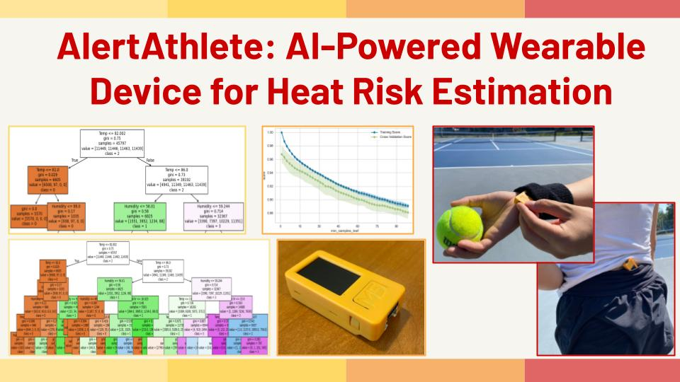

  

## Short Project Summary

## Extended Project Summary

It has been very hot in recent years. The years 2024 and 2023 were the hottest and the second hottest years in history, respectively, and the year 2025 is likely to be the third hottest. These high temperatures bring risk for heat-related illnesses (HRIs), such as heat cramps, heat exhaustion and heat stroke, which are a critical threat for anyone in summer and can cause death if not taken seriously. In the US, at least 2,325 HRI deaths were reported in 2023, and over 10,000 annual HRI deaths are estimated from 1997 to 2006.

HRIs affect thousands of athletes every year. There have been at least 77 HRI deaths among athletes in the US since 2000, and 65 of them (84%) are teenagers. Younger generations are more vulnerable due to their higher metabolism. HRIs are the top cause of preventable deaths for high school athletes. This is a major public health and humanity issue. 

This work, called AlertAthlete, proposes a method to estimate a heat alert level from a set of meteorological parameters readily available for athletes and coaches. It employs machine learning (ML) in compliance with a major heat safety policy. The proposed ML method is implemented in a Web application and a handy, wearable device to continuously track the current alert level during an athletic activity and issue early warnings for precautions and activity adjustment.

AlertAthelete uses the decision tree (DT) and random forest (RF) algorithms to build ML classifiers, which take a set of meteorological parameters as an input: temperature (F), relative humidity (%), cloud cover (%), precipitation (inch), wind speed (knot), and time of day. The classification output is one of the heat alert levels that are defined by Grundstein et al. and adopted by the National Federation of State High School Associations and its state affiliates (including Massachusetts Interscholastic Athletic Association). AlertAthelete deploys the proposed classifiers into a battery-operated ESP32 microcontroller to periodically download meteorological parameters from an online weather service and update the current alert level through deep sleep cycles. When the alert level is in the “high risk” or “extreme” condition, AlertAthelete raises a 100dB audible alarm with an on-board speaker. 

The proposed classifiers are trained with 45,777 meteorological data samples in the summer of 2024, which were collected from 290 cities in the US with an online database of the National Oceanic and Atmospheric Administration (NOAA). After hyperparameter adjustment, the DT and RF classifiers yield 91% and 99% classification accuracy in five-fold stratified cross-validation. Their classification speed is less than 0.02 second per sample. 

AlertAthelete has been empirically tested in tennis practice and matches in the spring and summer of 2025. It can be worn easily as it is the size of an eraser and lighter than a smart watch (5/8 oz). By saving its power consumption effectively, AlertAthelete can run over six hours, which is long enough for a sports practice and matches. Their audible alarm is highly noticeable even in intensive practices and matches. 

AlertAthlete allows athletes and coaches to be aware of their heat risk to take the necessary precautions (e.g. taking breaks in the shades and extra water), lower their chances of heat-related accidents (e.g. falls and ER visits), and perform the best of their ability. 

## Awards: 
- [Best Oral Presentation Award](https://past.the-iyrc.org/iyrcswinter-2025.html), "Machine Learning-based Heat Risk Estimation for Outdoor Sports," *12th International Young Researchers' Conference*, Columbia University Vagelos College of Physicians and Surgeons, New York City, NY, December 2025.  

## Publications:
- Hanna Suzuki, "Machine Learning-based Heat Risk Estimation for Outdoor Sports," In *Proc. of 12th International Young Researchers' Conference*, oral presentation paper, New York City, NY, December 2025. [preprint](https://github.com/HSSBoston/alertathlete/blob/main/doc/iyrc25fall.pdf), [presentation slides](https://docs.google.com/presentation/d/1y8TowAVRlK7Nh6zXVjnK0sNrilsj6rY8UVBl6g-LLL0/edit?usp=sharing), [video](https://www.youtube.com/watch?v=JGaz-hF8Z5Y)

## Presentations:
- H. Suzuki, "Machine Learning-based Heat Risk Estimation for Outdoor Sports", poster presentation, Sustainability Workshop, Japan Festival Boston, April 2026.
- Hanna Suzuki, "Integrating IoT and Machine Learning for Mobile and Wearable Heat Risk Tracking in Outdoor Sports," In *Proc. of the 29th Technological Advances in Science, Medicine, and Engineering*, poster presentation abstract, July 2025. [preprint](https://github.com/HSSBoston/alertathlete/blob/main/doc/tasme2025poster.pdf)

## Informal Context to this Project: 

I have been playing tennis from a young age, and last year joined the tennis team for my high school. Last season, I noticed the temperatures outside during matches were either very cold or very hot. When I had a match in April, it was a sunny day with 75 degrees after several cloudy days with 55 degrees. I found myself feeling dizzy and light-headed as I played in the sun. I needed to take extra and longer breaks and could not play my best. My coach told me it was a symptom of heat-related illness. In fact, some of my team mates had the same symptoms, and one of them had to visit the ER with an ambulance. 

This experience made me frustrated but curious because I thought heat-related illness occurs only in the southern states and no one has heat-related symptoms in April in Massachusetts. I researched these topics and learned that heat-related illness can actually develop in anyone who is not acclimatized to a hot and humid environment under the sun, regardless of the South or North, and regardless of spring or summer. Heat kills more people than cold in Massachusetts, and in any other states. In fact, Massachusetts’ heat-related ER visit rate is very high. I also learned that heat is a leading cause of preventable deaths and ER visits in college and high school sports. 

Upon further research, I came across Wet Bulb Globe Temperature (WBGT). It is a numerical index to indicate the heat stress on the body in direct sunlight by taking into account solar radiation, air temperature, humidity, and wind speed. It is recommended as a primary means to formulate heat safety policies by many organizations such as the CDC, National Federation of State High School Associations (NFHS), and US Tennis Association. 

WBGT is great, but WBGT meters are expensive (>$500ea). Thus, it is not often used in schools. NFHS has supplied grants for schools to purchase 5,000 meters, but there are over 18,000 public schools in the US. 

This motivated me to create something that can allow people, especially athletes, to know their heat risks to take precautions and prevent accidents. Then, I arrived at an idea to make an AI-powered and low-cost wearable device.

